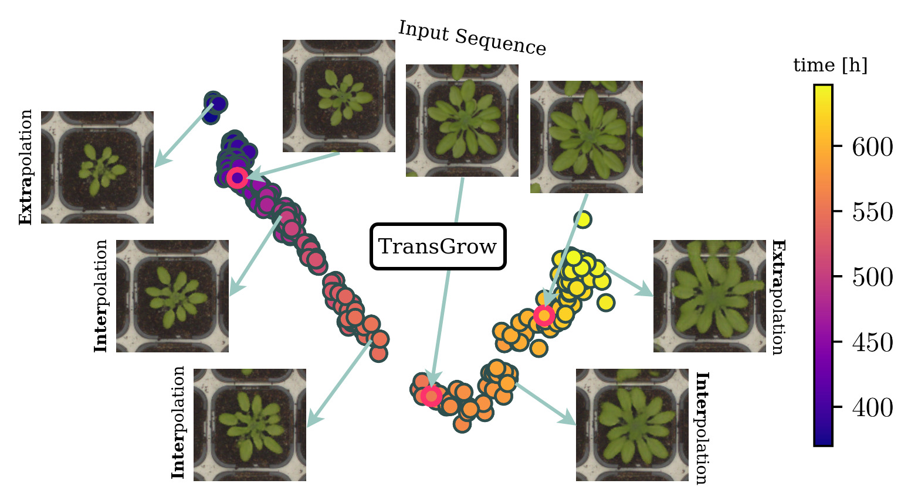

# TransGrow


**Picture:** *Generate realistic inter- and extrapolations for irregular plant time series.*

[Time dependent Image Generation of Plants from Incomplete Sequences with CNN-Transformer](https://doi.org/10.1007/978-3-031-16788-1_30) (GCPR 22)

## Requirements

A suitable conda environment can be installed from the provided package file environment.yml

    conda env create -f environment.yaml
    conda activate transgrow

## Configurations

This project is structured in such a way that all adjustable variables are stored in two configuration files as dictionary.  
For any details to the variables, please have a look into these files.

- Model training: ./configs/config_main_transgrow.py
- Model testing: ./configs/config_test_transgrow.py


## Data

#### General

In the following, we always use the term plant images to refer not only to datasets containing images with single plants, but also to field patches or satellite images that show a region of multiple plants per image.

The plant images must be sorted as a multi-temporal time series in folders. This means that for each plant/region a folder exists that contains images of all available time points of this plant/region. 

The images should be of quadratic size and the file names must contain at least one date, or even date+time, if modeling unit is to be finer than daily. From this time information, the temporal positions are calculated. 
The number of images per time series is flexible, i.e. not every time point has to exist for every plant. 
All plants are divided into train, val, and test set.

    ./
    └── data
      ├── MixedCrop  
      | ├── train
      |   ├── plant_01
      |   | ├── plant_01_2022-09-10.png
      |   | ├── plant_01_2022-09-12.png
      |   | ├── plant_01_2022-09-16.png
      |   | └── ...
      |   ├── plant_02
      |   | ├── plant_02_2022-09-10.png
      |   | ├── plant_02_2022-09-15.png
      |   | └── ...
      | ├── val
      |   ├── plant_03
      |   | ├── plant_03_2022-09-12.png
      |   | ├── plant_03_2022-09-16.png
      |   | └── ...      
      | └── test
      |   ├── plant_04
      |   | ├── plant_04_2022-09-10.png
      |   | ├── plant_04_2022-09-12.png
      |   | └── ...
      ├── Arabidopsis
      └── ...

#### Use Arabidopsis or MixedCrop data

Please find [here](https://uni-bonn.sciebo.de/s/Prq6Ga72sTErNXT) a small, multi-temporal sorted subsets of the [Arabidopsis](https://doi.org/10.5281/zenodo.168158) **'abd'** and the [MixedCrop](https://phenoroam.phenorob.de/geonetwork/srv/eng/catalog.search#/metadata/751c10c4-b6dc-4bcc-bc8c-c0fc5920887a) **'mix'** dataset.

- Change in ./configs/config_main_transgrow.py:

        cfg['data_name'] = 'abd' # or 'mix'


## Training
To train a TransGrow model run 

    python main_transgrow.py

Thereby the settings from ./configs/config_main_transgrow.py are used.
To resume a previous training, please enter the experiment name there and ensure, that architecture parameters are consistent.

## Testing
To test a previously trained model run

    python test_transgrow.py
    
You need to specify at least the log dir and the experiment name which you want to evaluate in ./configs/config_test_transgrow.py 

About the rest: Per default all parameters used to train the model are also used for testing.
But one advantage of TransGrow is that especially the data parameters (e.g. the number of input frames, or the time interval between them) can differ from training. So configuration parameters, which control the shape of the data, can be updated here as desired.

## Further Notes
MS-SSIM values in the paper are calculated with the normalized MS-SSIM (stabilizes the training), while the current repo for score calculation in the script test_transgrow.py has been switched to the non-normalized MS-SSIM calculation.

## Citation
```
@InProceedings{drees2022time,
  author    = {Drees, Lukas and Weber, Immanuel and Ru{\ss}wurm, Marc and Roscher, Ribana},
  title     = {Time Dependent Image Generation of Plants from Incomplete Sequences with CNN-Transformer},
  booktitle = {Proc.~of the DAGM German Conference on Pattern Recognition (GCPR)},
  year      = {2022},
  editor    = {Andres, Bj{\"o}rn and Bernard, Florian and Cremers, Daniel and Frintrop, Simone and Goldl{\"u}cke, Bastian and Ihrke, Ivo},
  pages     = {495--510},
  address   = {Cham},
  publisher = {Springer International Publishing},
  doi       = {10.1007/978-3-031-16788-1_30},
}
```

